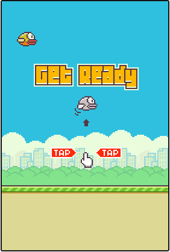

<h1 align="center">🐦 Flappy bird 🐦</h1>

 <a href="#sobre">Sobre</a> •
 <a href="#aprendizados">Aprendizados</a> •
 <a href="#instalacao">Instalação</a>  

  
  

 <h1>📚 Aprendizados. </h1>
 <ul>
  <li>Lógica de programação.</li>
  <li>Organização do código.</li>
  <li>Funções desenho no canvas.</li>
  <li>Operações ternária com números grandes.</li>
 </ul>

  
  

   <h1>ℹ️ Instalação.</h1>
    
O código está comentado em português com a lógica e objetivo de cada parte do código para quem quiser estudar.

  <ul>
    <li>
      
Abra seu editor de texto e no terminal digite o seguinte comando:

      
<code>$ git clone https://github.com/souzzs/flappy-bird.git</code>

    </li>
    <li>
      
Rode o projeto em um sevidor interno, usando por exemplo o <a href="https://marketplace.visualstudio.com/items?itemName=ritwickdey.LiveServer">Live server </a>.
    </li>
  </ul>

